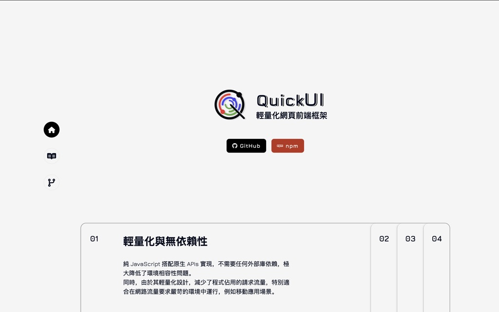
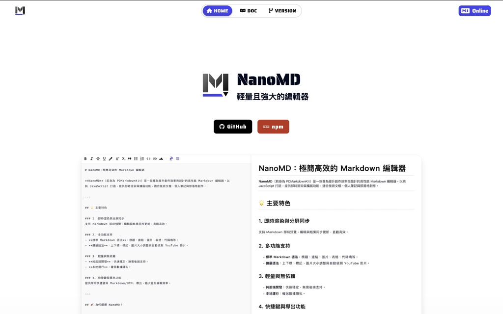
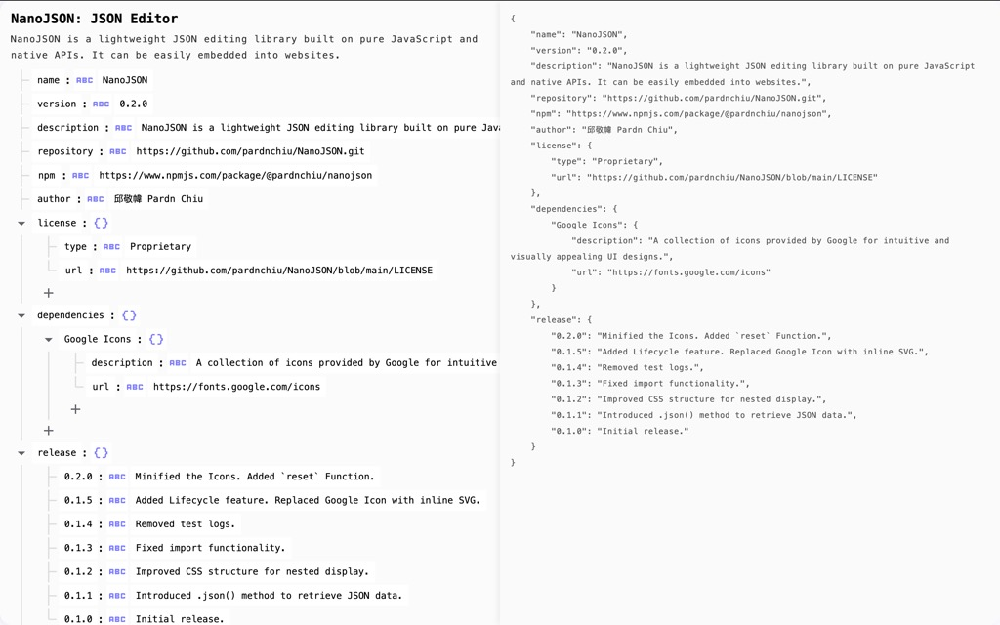
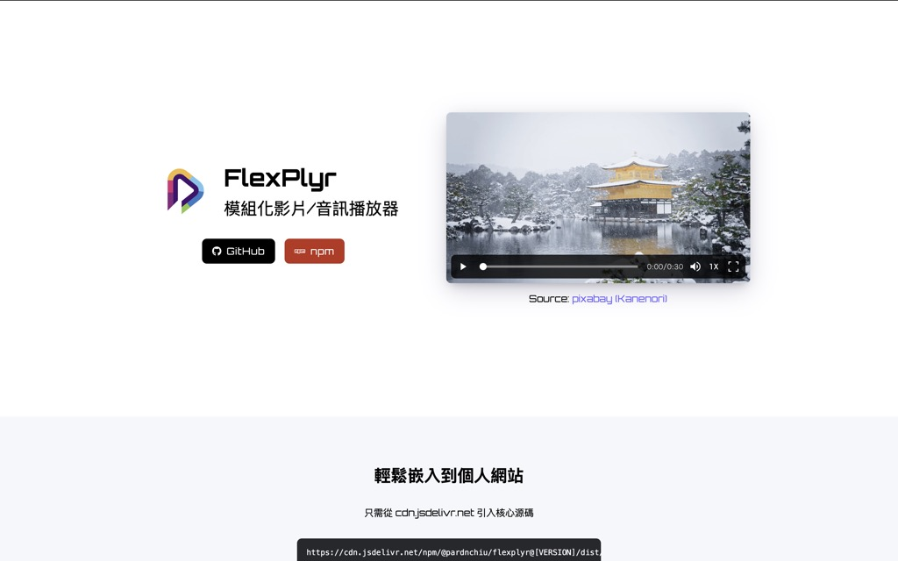
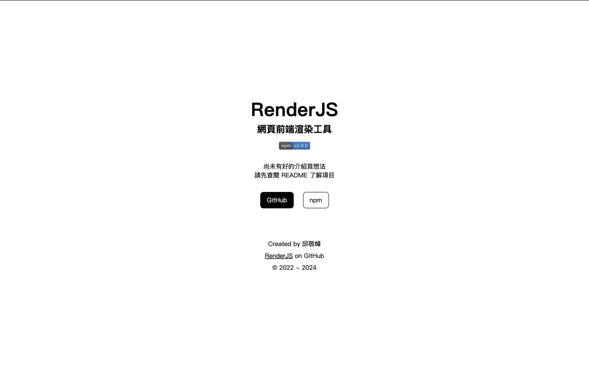
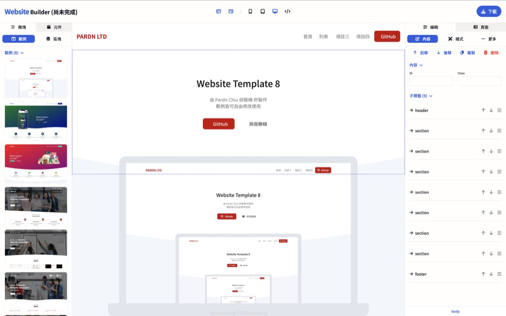
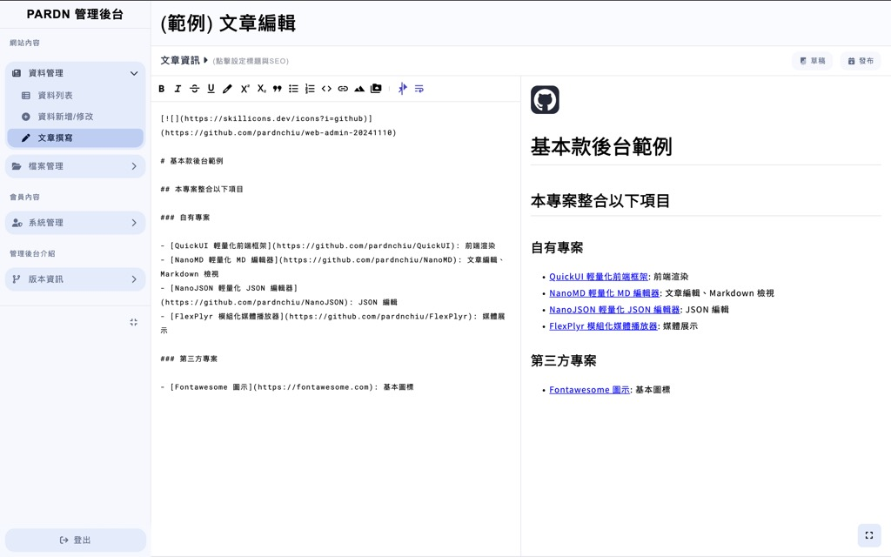
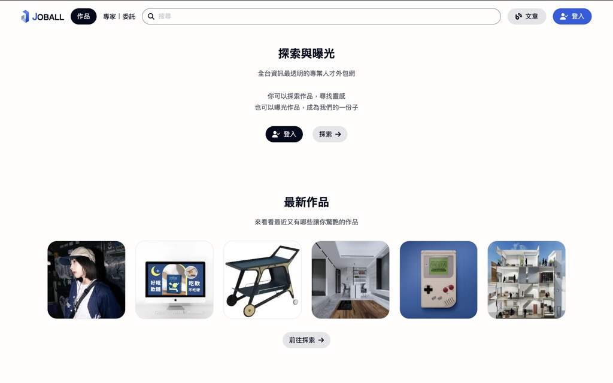

## 相關連結

| [使用技術](./使用技術.md) | [報價介紹](./報價介紹.md) | [收費與退款](./收費與退款.md) |
| :-: | :-: | :-: |
| [**開發模式**](./開發模式.md) | [**專案維護**](./專案維護.md) | [**常見問題**](./常見問題.md) |
| [**合約範本**](./合約範本.md) |

## 項目概覽

### QuickUI：前端框架（JavaScript 庫）

### NanoMD：Markdown 編輯器（JavaScript 庫）

### NanoJSON：JSON 編輯器（JavaScript 庫）

### FlexPlyr：媒體播放器（JavaScript 庫）

### RenderJS：前端擴展（JavaScript 庫）

### Website Builder：架站工具（網頁工具）

### Demo Admin：基本後台（網站範例）

### JOBALL 找專家：媒合平台

