## 關於我

我是[**邱敬幃 (Pardn Chiu)**](https://linkedin.com/in/pardnchiu)。 
一位具備iOS和網站全端開發技能的開發者，目前在[**帕登國際有限公司 (Pardn Ltd)**](https://linkedin.com/company/pardnltd)擔任全端工程師。 

- 原生iOS 
  熟練運用Swift／UIKit進行純代碼開發，不使用Storyboard、SwiftUI。
- 網站前端 
  擅長運用HTML、CSS／Sass與原生JavaScript開發SPA，不使用前端框架、架站平台。
- 網站後端 
  懂PHP、Python，且專精於使用Node.js搭配TypeScript。

擅於獨立開發，且對於經營自己的平台充滿熱情。 
除了開發網站模板和iOS範例至Github供他人下載，也獨立開發和經營以下平台。 

- [JOBALL找專家-專業人才外包網](https://joball.tw) 

對開發技術充滿熱情，並能提供高品質的解決方案。 
在開發iOS與網站皆具有豐富的經驗。 
如果您對我的技能和經驗感興趣，歡迎與我聯繫。 

- Email：[mail@pardn.ltd](mailto:mail@pardn.ltd)
- Website：[pardn.ltd](https://pardn.ltd)
- LINE@：[lin.ee/Gtcb5kc](https://lin.ee/Gtcb5kc)
- GitHub：[github.com/pardnchiu](https://github.com/pardnchiu)
- Linkedin：[linkedin.com/in/pardnchiu](https://linkedin.com/in/pardnchiu)

## 自營平台

| JOBALL找專家 |
| :-- |
|  |

## iOS / Swift (2)

| 預覽圖 | 預覽圖 |
| :-- | :-- |
|  |  [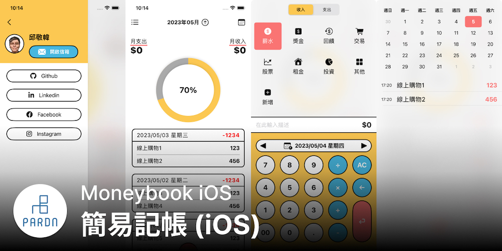](https://github.com/pardnchiu/moneybook-ios) |

## Web / HTML / CSS / JavaScript (34)

| 預覽圖 | 預覽圖 | 
| :-- | :-- | 
| [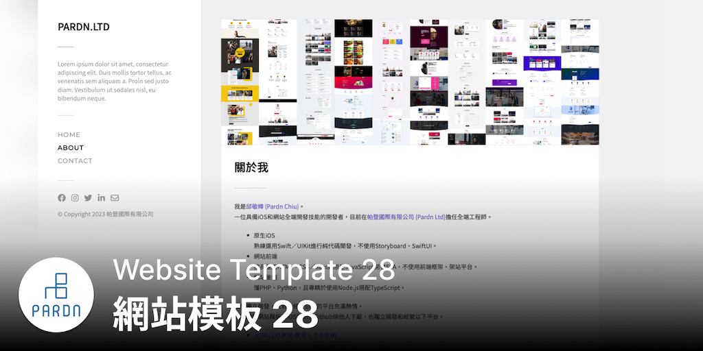](https://github.com/pardnchiu/website-template-28) | [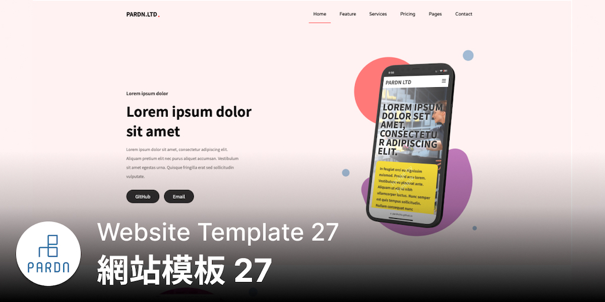](https://github.com/pardnchiu/website-template-27) | 
| [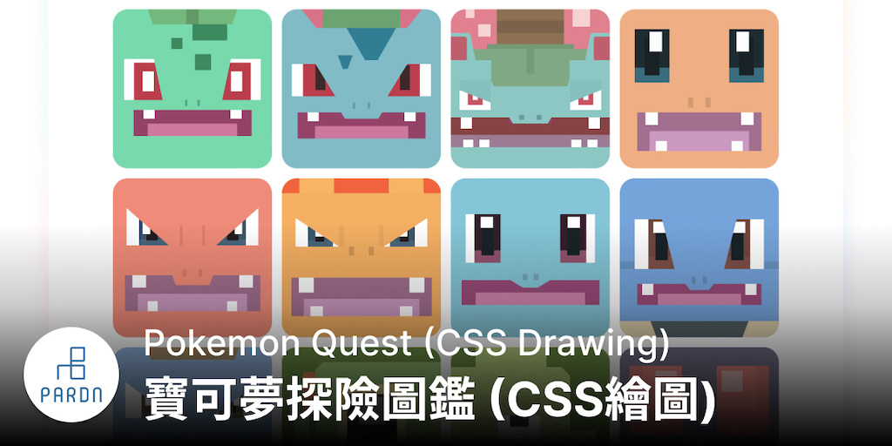](https://github.com/pardnchiu/pokemon-quest-css-drawing) |  [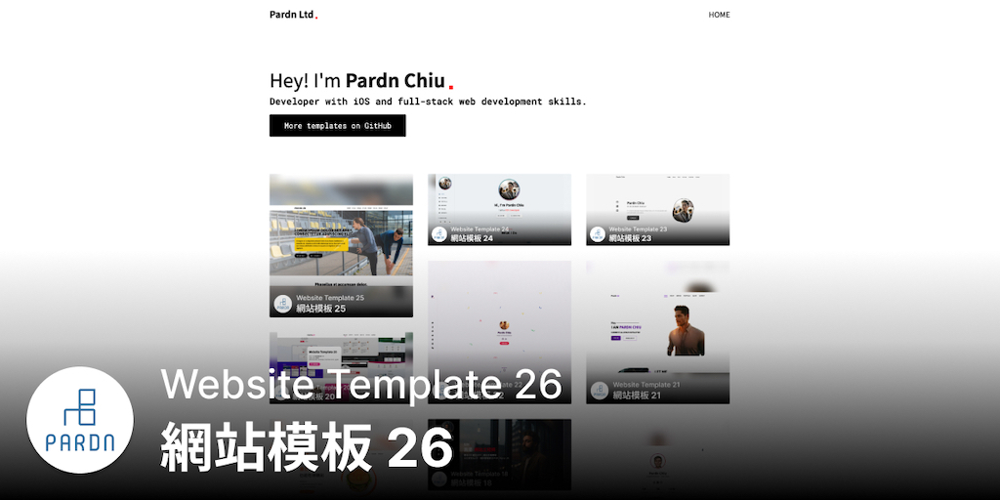](https://github.com/pardnchiu/website-template-26) |
|  |   |
| [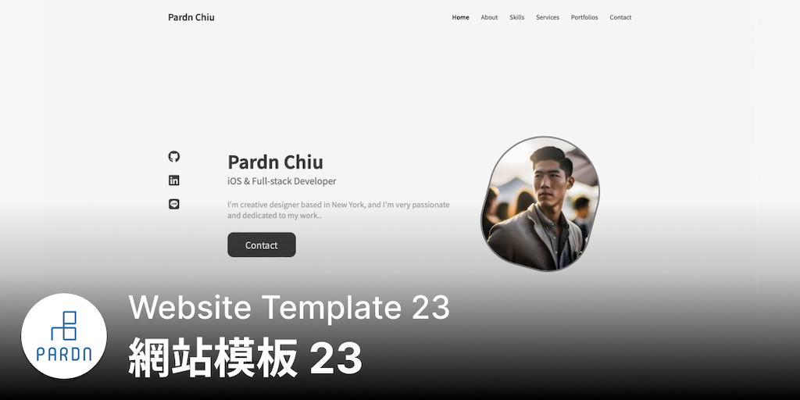](https://github.com/pardnchiu/website-template-23) |   |
|  |  [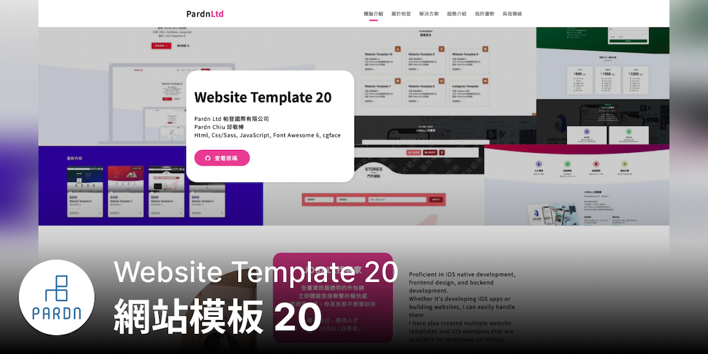](https://github.com/pardnchiu/website-template-20) |
| [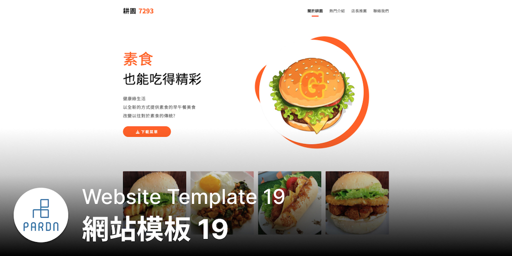](https://github.com/pardnchiu/website-template-19) |   |
| [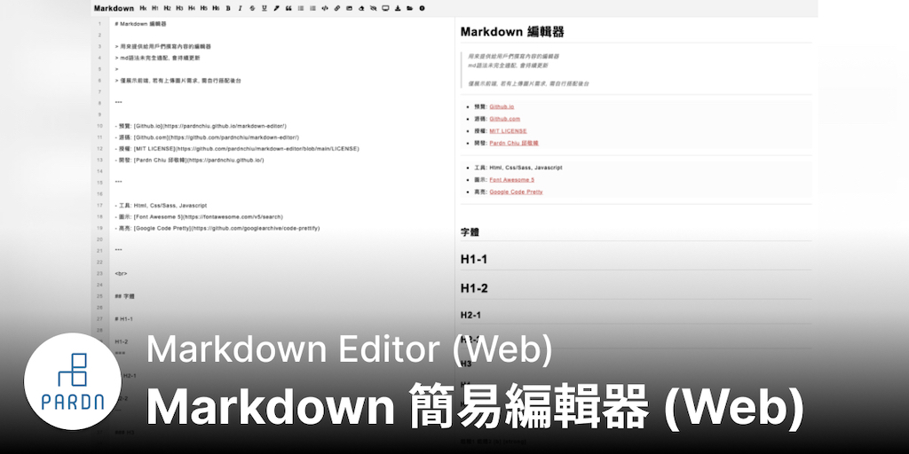](https://github.com/pardnchiu/markdown-editor-web) |   |
|  |  [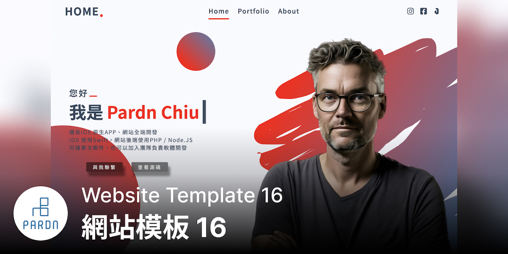](https://github.com/pardnchiu/website-template-16) |
|  |   |
| [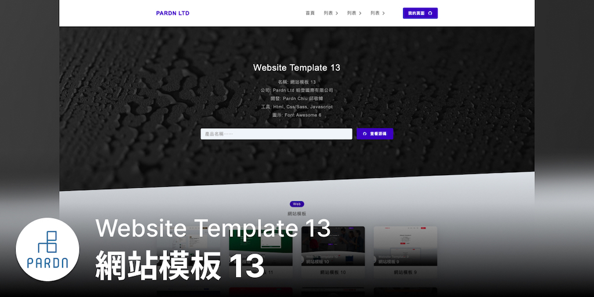](https://github.com/pardnchiu/website-template-13) |  [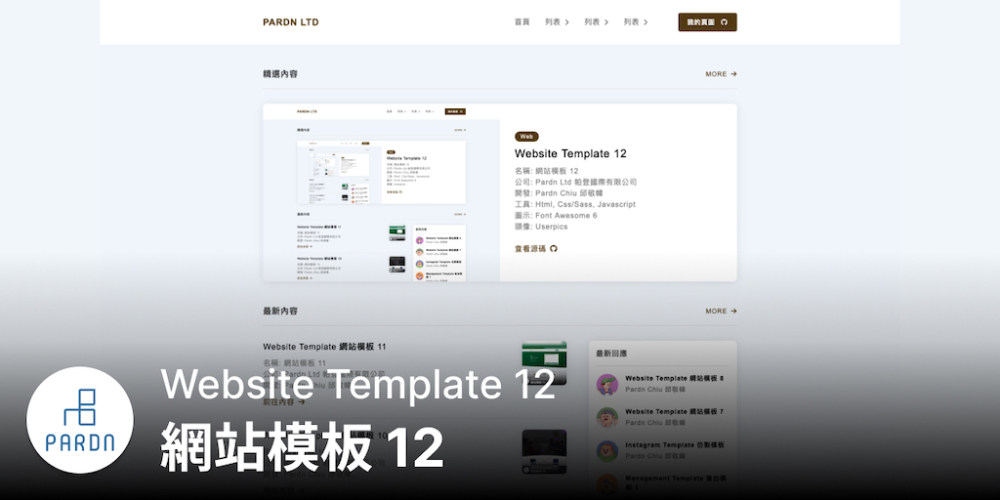](https://github.com/pardnchiu/website-template-12) |
|  |   |
| [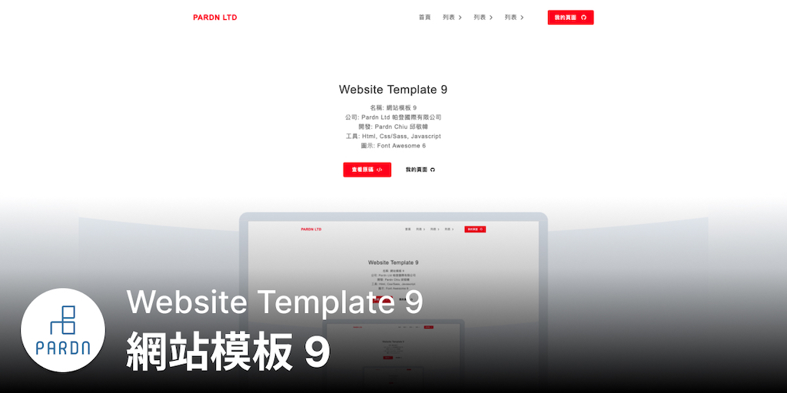](https://github.com/pardnchiu/website-template-9) |  [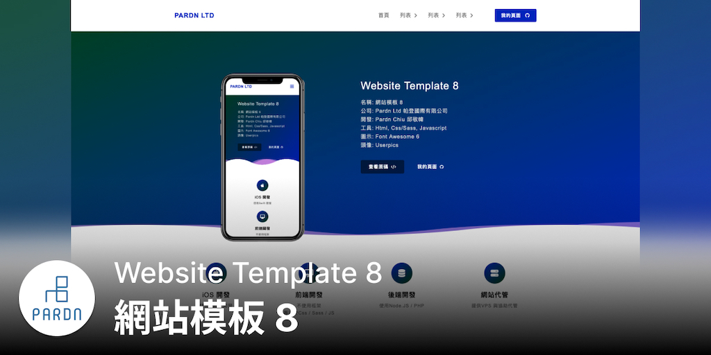](https://github.com/pardnchiu/website-template-8) |
|  |  [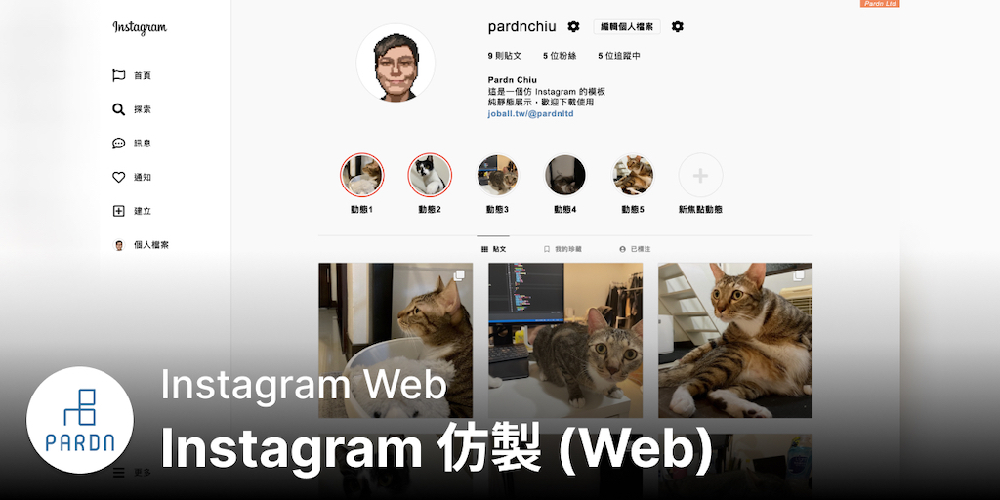](https://github.com/pardnchiu/instagram-202210-web) |
| [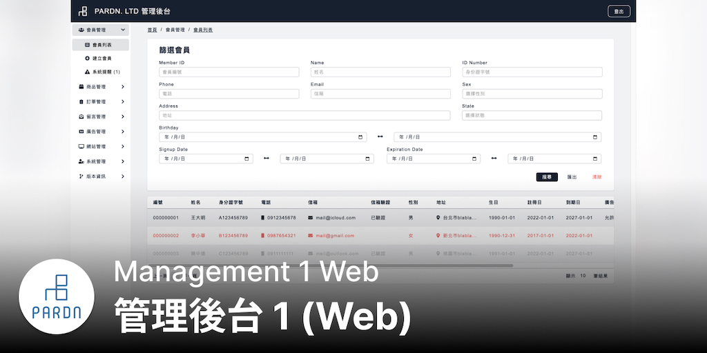](https://github.com/pardnchiu/management-1-web) |   [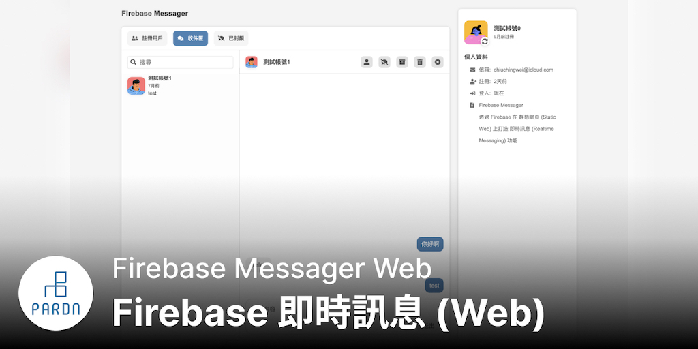](https://github.com/pardnchiu/firebase-messager-web) |
| [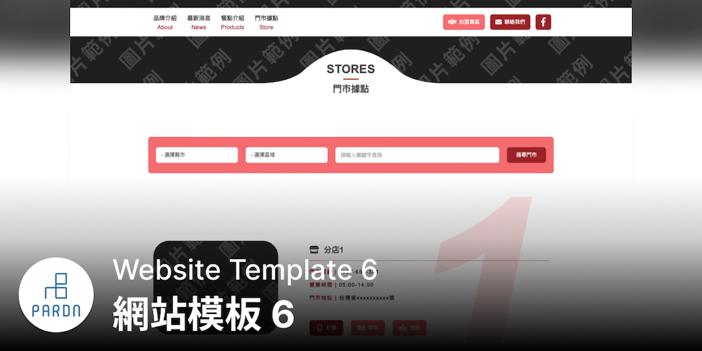](https://github.com/pardnchiu/website-template-6) |  |
|  |   |
|  |   |